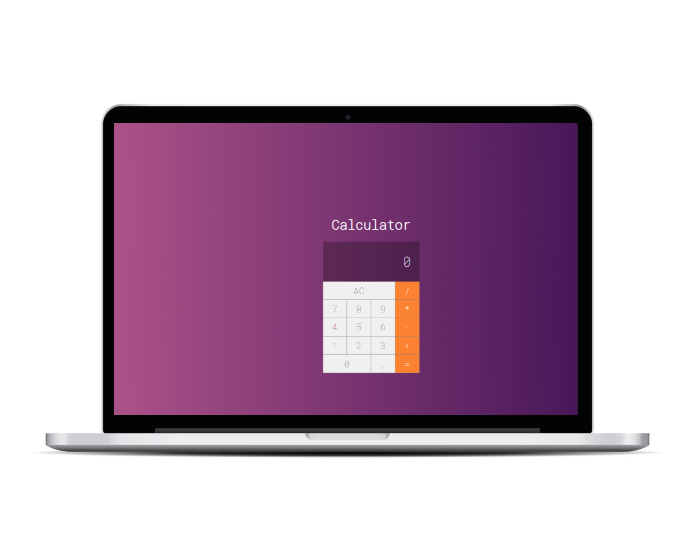

# Calculadora Básica Construida com React

## Descrição

Este projeto é uma calculadora básica criada com React. Ela suporta as seguintes operações: adição, subtração, multiplicação, divisão e porcentagem.

## Tecnologias Utilizadas

- JavaScript
- React

## Como Executar

1. Clone este repositório
2. Navegue até o diretório do projeto
3. Execute npm install para instalar as dependências
4. Execute npm start para iniciar o servidor de desenvolvimento
5. Agora você pode acessar a calculadora em http://localhost:3000.

## Funcionalidades

- Fazer calculos matemáticos. 

## Contribuindo

Se você deseja contribuir com este projeto, por favor, faça um fork do repositório e envie um pull request com suas alterações.
